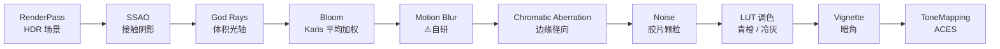
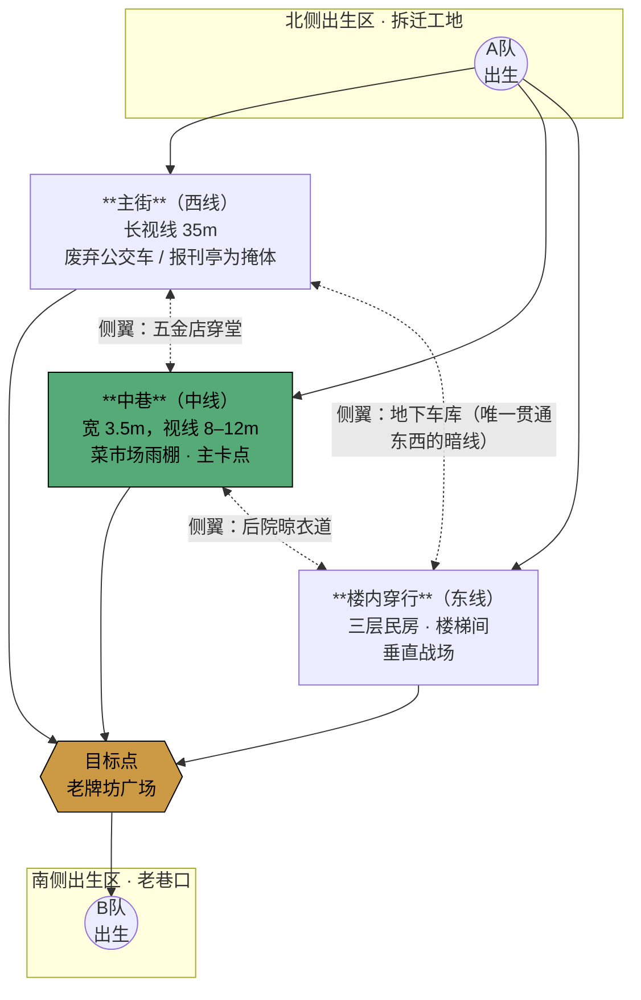
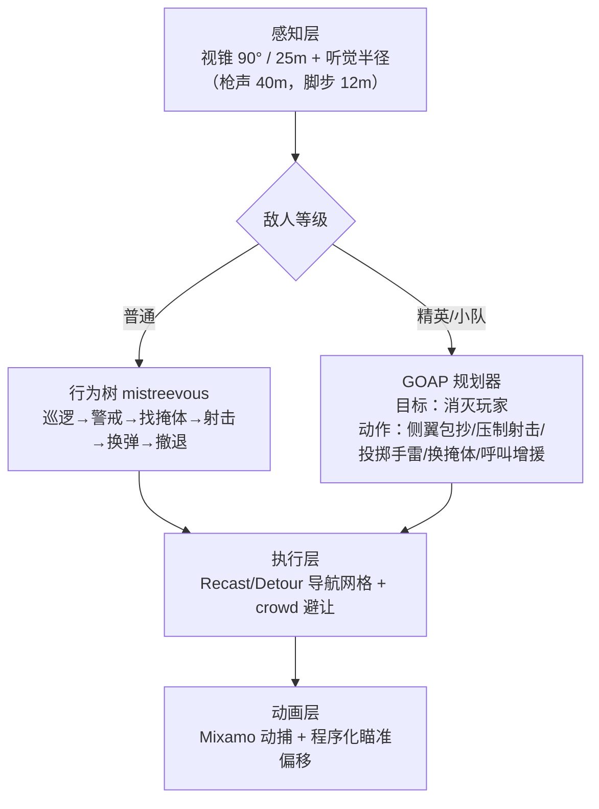

# 《暗巷 BACKSTREET》· 巷战枪战游戏设计方案

> 配套调研：[01-调研报告.md](01-调研报告.md)
> 版本：v1.0 · 2026-07-26

---

## 1. 项目定位

**一句话**：在一片将拆未拆的老城区里，用五把手感各异的枪，在门洞、雨棚、楼梯间之间打一场读得懂、打得爽、看得美的近距离遭遇战。

### 三根体验支柱

| 支柱 | 定义 | 可验证的成功标准 |
|---|---|---|
| **打击感** | 每一次开火与命中，都在同一帧砸下 8–10 层反馈 | 关掉音效仍能"看出"打中了；关掉画面仍能"听出"打中了 |
| **巷战空间** | 转角、门洞、二楼窗，视线在 3–15m 之间反复被切断和重连 | 玩家平均每 8 秒就要做一次"探头 / 绕后 / 后撤"的决策 |
| **特效优美** | 不是堆粒子，是**光**——枪口火光照亮墙面，曳光弹划开尘雾，弹着火花在暗巷里是唯一光源 | 静帧截图能直接当宣传图 |

### 反向定义（明确不做什么）

- ❌ 不做开阔战场、不做载具、不做大逃杀（100 人吃鸡）
- ❌ 不做写实军事模拟（不做弹道下坠计算、不做复杂的伤情系统）
- ❌ 首版不做多人（见第 9 章的分期理由）

---

## 2. 技术选型：three.js Web 栈

### 决策

**主线：Web / three.js + Rapier + bitECS + three.quarks + pmndrs/postprocessing。**

### 理由（按权重排序）

1. **本机现状**：Node 24 / npm 11 / git 已就绪，Godot / Unity / Unreal **一个都没装**。Web 栈今天就能 `npm create vite` 开工，其余方案要先花半天到一天装引擎、配 SDK、下 20GB。
2. **`Claude-of-Duty` 已经证伪了"Web 做不出好特效"**：MIT 开源、55k 行、纯 three.js，做出了 HDR + 级联阴影 + TAA + tile-dilated 动态模糊 + Karis Bloom + 体积雾光轴 + GPU 粒子 + 曳光弹 + 贴花的完整管线。天花板不在平台，在工程量——而这份源码正好是可读的施工图。
3. **迭代速度是打击感的命根子**。打击感不是设计出来的，是**调**出来的：改一个 trauma 系数 → 立刻看到 → 再改。Vite 热重载 <200ms，UE5 改个 C++ 编译 15–60s。这个差距会直接决定最后手感的上限。
4. **RTX 5060 Laptop + 32GB 内存**跑 WebGL2 绰绰有余，本地开发不会被性能挡住判断。
5. **分发成本为零**：一个 URL 就能给人试玩，收集手感反馈的速度是原生构建的几倍。

### 但要诚实说明的代价

| 代价 | 应对 |
|---|---|
| `pmndrs/postprocessing` **没有内置动态模糊**（官方标记 NYI） | 自己写速度缓冲 + tile-dilated pass，参考 Claude-of-Duty 的实现 |
| 没有 Niagara / VFX Graph 那种可视化特效编辑器 | 用 **three.quarks 的免费在线编辑器 quarks.art** 调好后导出 JSON，运行时加载 |
| 没有开箱即用的联机复制系统 | 首版单人；多人期用 geckos.io(WebRTC UDP) + 自建预测/和解（照 Gambetta 四篇实现） |
| 骨骼动画与 IK 工具链弱于原生引擎 | 用 Mixamo 出动画，程序化层（后坐力、摇摆、瞄准偏移）自己叠加——本来就该自己叠 |

### 备选路线（触发条件）

- **如果**做到 M2 发现视觉达不到预期，或团队里有 Unreal 老手 → 转 **UE5 + Lyra**（品质天花板最高，但迭代最慢）。
- **如果**必须原生分发且要免费无分成 → 转 **Godot 4 + KenneyNL Starter-Kit-FPS**（MIT + CC0，迭代也快）。
- 本方案的**玩法设计、打击感参数、关卡布局、特效配方全部与引擎无关**，换引擎不作废。

### 依赖清单

```json
{
  "dependencies": {
    "three": "^0.18x",
    "@dimforge/rapier3d-compat": "^0.14",
    "three-mesh-bvh": "^0.8",
    "three.quarks": "^0.15",
    "postprocessing": "^6",
    "bitecs": "^0.3",
    "recast-navigation": "^0.3",
    "@recast-navigation/three": "^0.3",
    "mistreevous": "^4",
    "howler": "^2"
  },
  "devDependencies": { "vite": "^7", "typescript": "^5", "lil-gui": "^0.20" }
}
```

> 版本号为示意，安装时取当时最新稳定版。**`lil-gui` 不是可选项**——它是打击感调参面板的载体，M0 就要接。

---

## 3. 打击感系统（本项目最重要的一章）

### 3.1 核心原则

> 打击感不是某一个效果，是**一叠廉价效果在同一帧同时砸下来**。
> 单独看每一层都很弱，叠在一起就成立。——这是 Vlambeer《The Art of Screenshake》的核心结论。

### 3.2 一次"步枪爆头击杀"的完整反馈时间线

```mermaid
gantt
    title 单次开火→命中→击杀 的反馈时间线（毫秒）
    dateFormat X
    axisFormat %L

    section 输入
    鼠标按下                :milestone, 0, 0
    section 本地即时（不等服务器）
    开火动画首帧             :a1, 0, 16
    枪口火光核心 sprite      :a2, 0, 50
    枪口动态点光源           :a3, 0, 33
    音频 transient+sub       :a4, 0, 120
    trauma += 0.18          :a5, 0, 5
    后坐力冲量注入            :a6, 0, 5
    曳光弹飞行               :a7, 0, 40
    section 命中反馈
    HIT-STOP 定帧            :crit, b1, 0, 100
    弹着火花                 :b2, 0, 150
    墙面尘烟                 :b3, 0, 800
    命中标记 hitmarker       :b4, 0, 70
    伤害数字上抛              :b5, 0, 700
    音频 命中 tick + 尾音     :b6, 0, 600
    section 击杀
    击杀慢镜 timeScale 0.35   :crit, c1, 100, 500
    尸体 ragdoll             :c2, 100, 900
    section 残留
    抛壳落地                 :d1, 33, 900
    弹孔贴花（保留 30s）      :d2, 0, 1000
```



**关键工程约束**：
- 命中反馈**全部由客户端本地射线立即触发**，不等服务器确认（多人期由服务器做权威校正，误判时不回收已播的特效，只修正伤害数字）。
- **hit-stop 期间粒子、相机震动、后处理必须继续按正常速度走**，否则读起来是"卡了"而不是"打中了"。实现：这些系统一律用 `unscaledDelta`。

### 3.3 屏幕震动：trauma 模型

出处：Squirrel Eiserloh, GDC 2016。

```ts
// feel/trauma.ts
class Trauma {
  private t = 0;                       // 0..1
  private readonly decay = 1.2;        // 每秒衰减量 → 满值约 0.83s 归零
  private readonly freq  = 22;         // Hz
  private readonly maxPitch = 2.5;     // 度
  private readonly maxYaw   = 2.0;
  private readonly maxRoll  = 3.5;     // roll 给最大：转起来最有劲且最不晕

  add(amount: number, distance = 0, falloffRadius = 0) {
    // 爆炸类按距离平方衰减
    const k = falloffRadius > 0
      ? 1 / (1 + (distance * distance) / (falloffRadius * falloffRadius))
      : 1;
    this.t = Math.min(1, this.t + amount * k);
  }

  update(dt: number, time: number): { pitch: number; yaw: number; roll: number } {
    this.t = Math.max(0, this.t - this.decay * dt);
    const shake = this.t * this.t;                    // ⚠ 平方是关键：小 trauma 几乎不动，大 trauma 猛砸
    const n = (seed: number) => noise2D(seed, time * this.freq) * 2 - 1; // Perlin/simplex，不是 Math.random()
    return {
      pitch: this.maxPitch * shake * n(11.3),
      yaw:   this.maxYaw   * shake * n(37.7),
      roll:  this.maxRoll  * shake * n(59.1),
    };
  }
}
```

**三个最容易做错的点：**
1. 用 `Math.random()` 逐帧取值 → 变成高频抖动，又丑又晕。**必须用连续噪声**。
2. 幅度直接用 `trauma` 而非 `trauma²` → 小事件也在晃，画面永远不安定。
3. 只做平移不做旋转 → 力量感弱一半。**roll（横滚）是最有性价比的一轴**。

### 3.4 Hit-Stop（定帧）—— 单项性价比最高的技巧

```ts
// feel/hitstop.ts —— 只冻结"参战者"，世界其余部分照常
function hitStop(frames: number) {
  const ms = frames * 16.67;
  combatTimeScale = 0;                 // 影响：角色动画、移动、弹道推进
  // 不受影响：粒子、trauma 震动、后处理、UI、音频
  setUnscaledTimeout(() => { combatTimeScale = 1; }, ms);
}
```

| 事件 | 定帧时长 | 备注 |
|---|---|---|
| 普通命中（躯干） | 2 帧 / 33ms | 几乎察觉不到，但去掉就"软" |
| 四肢命中 | 1 帧 / 17ms | |
| 爆头 | 5 帧 / 83ms | 配合更亮的 hitmarker + 高音 tick |
| 击杀 | 7 帧 / 117ms | 之后接慢镜 |
| 霰弹枪贴脸（≥6 弹丸命中） | 8 帧 / 133ms | 本作最"重"的一击 |
| 手雷直接杀伤 | 6 帧 / 100ms | |

> **注意**：定帧的计时器必须用**不受 timeScale 影响的时钟**（`performance.now()`），否则 timeScale=0 时定时器永远不触发，游戏直接冻死。这是这个技巧最经典的翻车点。

### 3.5 后坐力：弹簧模型

```ts
// feel/recoil.ts
// 每次开火：给 target 注入冲量；每帧 current 追 target，target 回落到 0
onFire(w: WeaponDef) {
  recoilTarget.x -= w.recoilVert;                              // 抬枪口（pitch 负 = 向上）
  recoilTarget.y += (Math.random() * 2 - 1) * w.recoilHoriz;   // 左右随机
  recoilTarget.z -= w.recoilKick;                              // 后座（视觉上枪往后缩）
}

update(dt) {
  // 指数插值，与帧率无关
  const toCurrent = 1 - Math.exp(-SNAPPINESS * dt);   // SNAPPINESS = 18  → 打出去很脆
  const toZero    = 1 - Math.exp(-RETURN_SPEED * dt); // RETURN_SPEED = 8 → 回正慢一点，才有"压枪"的余味
  recoilCurrent.lerp(recoilTarget, toCurrent);
  recoilTarget.lerp(ZERO, toZero);
  camera.rotation.x += recoilCurrent.x;               // ⚠ 叠加在瞄准旋转之上，不是替换
  camera.rotation.y += recoilCurrent.y;
}
```

**枪口上抬（muzzle rise）**：连发时在美术动画之上叠加一个**累积**的向上加性旋转，射击停止后缓动归零。这让"扫射时越打越飘"成为可感知的机制，而不是纯随机散布。

### 3.6 命中确认层

| 层 | 规格 |
|---|---|
| **Hitmarker** | 准星四条短线向外弹开 70ms 后收回；普通=白色；爆头=金色且更大；击杀=红色 ✕ 且带 0.1 缩放 punch |
| **音频 tick** | 与 hitmarker 同帧。普通 = 干脆的中频 click；爆头 = 高一个八度 + 轻微金属感；击杀 = 低沉的 thud + 短混响 |
| **伤害数字** | **必须对象池化**（预实例化 32 个）。上抛贝塞尔弧线 + 淡出 + scale 从 1.3 过冲回落到 1.0，生命 0.7s。爆头字号 ×1.5 + 金色 + 额外轻抖 |
| **手柄震动** | 双马达：低频给"重量"（霰弹/狙击/爆炸），高频给"细节"（SMG 点射）。脉冲 50–150ms，与定帧、震动**同帧**落下 |
| **受击反馈** | 屏幕边缘方向性血迹（指向伤害来源方位）+ 相机沿受击轴向被推 + trauma += 0.35 + 低通滤波音频 0.4s |

### 3.7 全套开关面板（M0 就要有）

```
[打击感调参]                        —— lil-gui
├ 全局
│  ├ □ 打击感总开关 (A/B 对比用)
│  └ 时间缩放  [1.0]
├ 屏幕震动
│  ├ ☑ 启用   衰减[1.2]  频率[22]
│  └ 最大 pitch[2.5] yaw[2.0] roll[3.5]
├ 定帧
│  ├ ☑ 启用   普通[2帧] 爆头[5帧] 击杀[7帧]
├ 后坐力
│  ├ 追随刚度[18]  回正速度[8]
├ 反馈层  (每层独立开关，用于逐条验证价值)
│  ├ ☑枪口火光 ☑动态光 ☑曳光弹 ☑抛壳
│  ├ ☑弹着火花 ☑尘烟 ☑贴花 ☑血效
│  └ ☑Hitmarker ☑伤害数字 ☑手柄震动
└ [导出当前配置为 JSON]
```

> 这个面板不是"锦上添花的工具"，它是**打击感能不能调出来的前提**。Vlambeer 那场演讲的说服力，就来自于每个技巧都能单独开关。

---

## 4. 武器与战斗系统

### 4.1 数据驱动的武器定义

每把枪是一个 JSON（参考 KenneyNL Starter-Kit-FPS 的 resource 模式），改数值不改代码：

```jsonc
// weapons/defs/ar15.json
{
  "id": "ar15", "name": "AR-15", "class": "rifle",
  "damage": 30, "rpm": 700, "mag": 30, "reloadSec": 2.4, "reloadEmptySec": 2.9,
  "spreadStand": 0.8, "spreadMove": 2.6, "spreadADS": 0.35,   // 度
  "recoilVert": 1.7, "recoilHoriz": 0.6, "recoilKick": 0.04,
  "trauma": 0.18, "hitstopNormal": 2, "hitstopHead": 5,
  "falloffStart": 30, "falloffEnd": 60, "falloffMinMul": 0.65, // 米
  "penetration": 0.6,
  "muzzleVfx": "muzzle_rifle", "tracerVfx": "tracer_hot", "shellVfx": "shell_556",
  "audio": { "body": "ar15_body_*", "mech": "ar15_mech_*", "tail": "$env_tail_*" }
}
```

### 4.2 首发五把枪

| 武器 | 定位 | 伤害 | 射速 | 弹匣 | 换弹 | 散布 静/动/ADS | 后坐 垂/横 | trauma | 定帧 普/头 | 有效距离 |
|---|---|---|---|---|---|---|---|---|---|---|
| **P9** 手枪 | 保底，快速切枪 | 26 | 400 | 15 | 1.6s | 0.6 / 1.8 / 0.25 | 1.4 / 0.5 | 0.12 | 2 / 5 | 25m |
| **MP7** 冲锋枪 | 巷道突进王 | 20 | 900 | 30 | 2.0s | 1.2 / 3.0 / 0.6 | 0.9 / 0.7 | 0.10 | 2 / 4 | 18m |
| **AR-15** 步枪 | 全能，主武器 | 30 | 700 | 30 | 2.4s | 0.8 / 2.6 / 0.35 | 1.7 / 0.6 | 0.18 | 2 / 5 | 45m |
| **SG-12** 霰弹枪 | 门洞守卫者 | 13×8 弹丸 | 90 | 6（逐发装填，可打断） | 3.2s | 锥角 3.5° | 4.5 / 1.2 | 0.42 | 3 / 8 | 9m |
| **M-DMR** 精确射手步枪 | 长巷压制 | 65 | 260 | 10 | 2.8s | 0.3 / 2.2 / 0.1 | 3.2 / 0.8 | 0.50 | 4 / 7 | 80m |

**投掷物**：破片手雷（1.5s 引信，杀伤半径 4m / 溅射 8m）、烟雾弹（**能挡住 AI 视线和玩家视线，是巷战的核心战术道具**）。

### 4.3 伤害模型

```
最终伤害 = 基础伤害
         × 部位倍率        (头 2.0 / 胸腹 1.0 / 四肢 0.85)
         × 距离衰减        (falloffStart 内 1.0，到 falloffEnd 线性降到 falloffMinMul)
         × 穿透衰减        (每穿透一层墙 × 材质系数)
         × 护甲减免        (护甲 >0 时伤害 ×0.6，同时护甲值 -= 原伤害×0.5)
```

**生命**：100 HP + 50 护甲。**不自动回血**——受伤只能靠拾取医疗包，这会让"退出交火"成为真实决策。

**TTK 目标**（这是巷战节奏的定盘星）：

| 场景 | 命中数 | TTK |
|---|---|---|
| AR-15 打无甲躯干 | 4 | ~257ms |
| AR-15 打有甲躯干 | 6 | ~429ms |
| AR-15 一头两身（无甲） | 3 | ~171ms |
| MP7 无甲躯干 | 5 | ~267ms |
| SG-12 贴脸（8 弹丸全中） | 1 | 0ms（秒） |
| M-DMR 爆头 | 1 | 0ms |

> 设计意图：**300–450ms 区间**。比 CS 慢一点（给转角遭遇后的反应留窗口），比 COD 快（保持紧张）。霰弹和爆头保留"瞬杀"作为高风险高回报的出口。

### 4.4 穿墙（wallbang）

材质表——直接影响关卡设计的"软硬掩体"划分：

| 材质 | 穿透系数 | 巷战语义 |
|---|---|---|
| 木板 / 三合板 | 0.75 | 拆迁区的临时隔断，几乎挡不住子弹 |
| 铁皮 / 广告牌 | 0.55 | 看着像掩体，其实是陷阱 |
| 薄砖 | 0.25 | 能穿但代价大 |
| 混凝土 / 承重墙 | 0.00（不可穿） | 唯一的真掩体 |
| 玻璃 | 0.95 + **碎裂** | 破了就永久改变视线 |

> 这一条把关卡从"几何"变成了"信息"：玩家必须**学会认材质**。这是巷战最好的深度来源，而且几乎零额外成本。

### 4.5 移动系统

| 动作 | 参数 | 巷战意义 |
|---|---|---|
| 走 / 跑 | 3.2 / 5.6 m/s | |
| 蹲 | 1.6 m/s，碰撞胶囊高度 1.8→1.2 | 矮掩体后的核心姿态 |
| **探头 lean（Q/E）** | 相机横移 ±0.35m + roll ±12° | **巷战的灵魂**：不暴露身体切角 |
| 滑铲 | 从跑步进入，1.1s，可射击但散布 ×2.5 | 突破门洞的进攻手段 |
| 翻越 vault | 高度 ≤1.2m 的矮墙，0.6s | 制造非常规路线 |
| 冲刺后开火延迟 | 0.18s 举枪 | 惩罚无脑冲 |

**⚠ 不做**：跳跃射击（会退化成兔子跳互蹦，毁掉巷战的沉稳感）。跳跃保留，但**空中散布 ×4**。

---

## 5. 特效（VFX）方案

### 5.1 设计哲学

> 暗巷里最漂亮的东西不是粒子，是**光**。
> 每一次开火都应该短暂地照亮周围的墙、地面和飞尘——这一个决定，比加十万个粒子都有效。

### 5.2 枪口火光（分层配方）

| 层 | 实现 | 时长 |
|---|---|---|
| 火光核心 | 2–3 片交叉 billboard + additive flipbook（Kenney Particle Pack） | 2 帧 |
| **动态点光源** | `PointLight` 强度 8→0，颜色 `#ffd9a0`，半径 6m | 2 帧 |
| 火花子发射器 | three.quarks sub-emitter，12–20 个拉伸 billboard 沿枪口锥向抛出 | 0.25s |
| 枪口烟 | trail renderer，缓慢上升淡出 | 0.6s |
| Bloom 响应 | 火光核心亮度设在 bloom 阈值之上，让辉光自然发生 | — |

> **性能提示**：动态点光源是最贵的一层。用**光源池**（同时最多 4 盏），超出时按距离玩家远近淘汰。

### 5.3 曳光弹

- three.quarks **stretched-billboard**（速度对齐的拉伸四边形）+ additive 材质
- **不是每发都有**：步枪每 3 发一条，SMG 每 4 发一条（全都有反而变成激光秀，且掩盖了单发的清晰度）
- 起点是**枪管末端**而非相机中心——否则近距离会看到曳光从脸上射出

### 5.4 弹着效果（按材质分派）

| 表面 | 火花 | 尘烟 | 贴花 | 音效 |
|---|---|---|---|---|
| 混凝土 / 砖 | 少量橙色 | **灰白粉尘团（主角）** | 弹坑 + 白灰扩散 | 干脆的"啪" |
| 金属 / 铁皮 | **大量白热火花（主角）** | 无 | 凹痕 + 刮痕 | 尖锐的"铛"+ 跳弹尾音 |
| 木材 | 少量 | 木屑碎片 | 弹孔 + 毛边 | 闷响 |
| 玻璃 | 无 | 玻璃碎屑 | **整块碎裂 + 掉落** | 清脆碎裂 |
| 泥土 / 积水 | 无 | 土块 / 水花 | 浅坑 / 涟漪 | 噗 |
| 人体 | 无 | **血雾（沿弹道方向喷出）** | 地面血迹 | 湿闷的 thud |

> 实现要点：**碰撞体上打材质标签**，射线命中后查表分派。这是"一个系统换十倍质感"的典型。

### 5.5 贴花

```ts
// 三个必须的设置，缺一个就穿帮
new MeshBasicMaterial({
  transparent: true,
  depthTest: true,
  depthWrite: false,        // 否则贴花之间互相遮挡出黑边
  polygonOffset: true,
  polygonOffsetFactor: -4,  // 否则与墙面 z-fighting 闪烁
});
```
- **LRU 池，上限 256**。超出时最老的先淡出移除（Vlambeer 说的"永久痕迹"很重要，但内存不是无限的）。
- 血迹和弹孔分池，血迹上限 64。

### 5.6 后处理管线（顺序即质量）



| 效果 | 参数取向 | 为什么 |
|---|---|---|
| **Bloom** | 阈值 0.85，强度 0.6，**克制** | 只让枪口火光、曳光弹、路灯发光。过量 = 廉价感 |
| **God Rays** | 用 `three-good-godrays`，密度 0.4 | 尘雾中的光轴，是"巷战氛围"的最大功臣 |
| **SSAO** | 半径 0.5m，强度 0.6 | 让物件"坐"在地上，不飘 |
| **色差** | 边缘 0.0015，中心为 0 | 只在视野外围，中心必须清晰（否则影响瞄准） |
| **胶片颗粒** | 0.03，极轻 | 掩盖低分辨率贴图的塑料感 |
| **LUT** | 阴影压青、高光偏橙 | 让每一次开火的暖色火光在冷调环境里"跳"出来 |
| **暗角** | 0.35 | 把注意力锁在中心 |

**ADS（机瞄）时**：景深开启（背景 blur）、FOV 从 90° 缩到 65°、色差减半。这几项的**过渡曲线**（0.18s，ease-out）本身就是打击感的一部分。

### 5.7 性能预算

| 项目 | 预算 | 备注 |
|---|---|---|
| 目标帧率 | 1080p / 60fps（RTX 5060 Laptop 应能 1440p / 120fps） | |
| Draw calls | < 800 | three.quarks 的 BatchedRenderer 把所有粒子合成极少的 call |
| 三角形 | < 1.5M | 低多边形美术方向的直接收益 |
| 活跃粒子 | < 8000 | |
| 动态光源 | ≤ 4 盏（枪口/爆炸池化） + 8 盏静态烘焙 | 最贵的一项 |
| 贴花 | ≤ 256（LRU） | |
| 纹理显存 | < 512MB | 用 KTX2/Basis 压缩 |
| 低配降级 | 集显 / 720p：关 SSAO + God Rays + 动态模糊，Bloom 降半分辨率 | 画质设置里做成三档预设 |

---

## 6. 关卡设计：《老城南》

### 6.1 三个尺度的设计规则（来自调研）

- **宏观 — 三线**：三条出生点到出生点的主路线，每条含 1 条主路 + ≥1 条侧翼；全程交叉连通，让两队在一条**移动的战线**上相遇。
- **中观 — 卡点**：收窄到 1–2 个清晰可见的入口；卡点放在目标点**之前**；调出生距离让两队几乎同时到达（守方略早）。
- **微观 — 掩体**：**低掩体优于高掩体**（保留态势感知 + 多个射击角）；宽、独立（360°可绕）的掩体交错摆放，之间保留清晰视线；**宁少勿多**；转角做 90° 锐角以支持"切派"清角。

### 6.2 地图布局

尺寸约 **90m × 60m**，三条纵向路线：



### 6.3 三条线的性格（一图三玩法）

| 线路 | 视线长度 | 掩体密度 | 适配武器 | 风险 |
|---|---|---|---|---|
| **西线 主街** | 25–35m | 低（宽掩体，间距大） | M-DMR、AR-15 | 视野开阔 = 谁先看见谁赢，被架住寸步难行 |
| **中线 中巷** | 6–12m | 高（雨棚柱、三轮车、菜筐） | MP7、SG-12 | 最短路径，也是最高频交火区 |
| **东线 楼内** | 3–8m + 二楼俯射 | 中（门框、家具，**多为可穿透的木隔断**） | SG-12、MP7 | 转角多、清房慢，但拿下二楼窗口就能俯瞰中巷 |
| **暗线 地下车库** | 15m 直线，仅两个出口 | 极低 | 任意 | 唯一东西贯通线，进去就没有退路 |

### 6.4 四个关键卡点

| 卡点 | 类型 | 入口数 | 设计意图 |
|---|---|---|---|
| **菜市场雨棚** | 主防守卡点 | 2 | 中线必经，雨棚柱提供低掩体，头顶有铁皮（可穿透）→ 上方压制可行 |
| **老牌坊口** | 目标点前置卡点 | 3 | 三线在此汇合，攻方必须至少控住两个入口 |
| **五金店穿堂** | 次要强攻通道 | 2（一进一出） | 绕后用，但很窄，一颗手雷就能封死 |
| **楼梯间 B 段** | 垂直卡点 | 2（上下） | 争夺二楼视野的唯一通道，霰弹枪的主场 |

### 6.5 巷战独有的关卡语汇

- **可破坏的视线**：玻璃窗、彩钢瓦、晾晒的床单——打碎/打穿之后**永久改变**这个位置的攻防关系。
- **垂直**：二楼窗、屋顶晾台、地下车库。三个高度层让一张 90×60 的图有 CS 大图的战术容量。
- **假掩体**：铁皮广告牌、木板围挡看起来能躲，其实穿透系数 0.55/0.75。**让玩家吃一次亏就学会读材质。**
- **光作为路标**：暗巷里唯一的亮处（路灯、破洞漏下的天光、燃烧的垃圾桶）自然引导走位，同时也是最危险的位置。

### 6.6 制作顺序（重要）

> **先灰盒，后美术。** 用 Kenney "Development Essentials" 或 KayKit "Prototype Bits"（都是 CC0）把三线 + 卡点 + 掩体摆出来，**先验证走位时间和视线**，再换真资产。
> 验证指标：两队从出生点到中线卡点的时间差 ≤ 1.5s（守方略早）；从任一掩体到下一个掩体的暴露时间 ≤ 1.2s。

---

## 7. 敌人 AI（单人模式）

### 分层架构



**为什么用 GOAP**：F.E.A.R. 的 AI 之所以至今被当作标杆，就是因为 GOAP 让侧翼包抄、火力压制、协同用掩体**涌现**出来而不是脚本写死。这恰恰是巷战最需要的行为。现代共识：**GOAP 管高层决策，行为树管底层执行**。

**巷战专属的 AI 行为**：
- **切角（slice the pie）**：接近转角时贴墙侧移逐步展开视野，而不是直冲过去
- **烟雾反应**：视线被烟阻断时改为**朝烟里盲射压制**或绕行，而不是站着发呆
- **听声定位**：听到枪声后向声源方向的**掩体**移动，而非直线冲向声源
- **组队报点**：一个 AI 发现玩家后，把位置广播给 12m 内的队友（模拟喊话）

### 单人模式："清巷"

15 分钟一局。从地图一端推进到另一端，8–12 个敌人分批出现在预设的战术位置。
**每次开局敌人位置从预设池中随机抽取**（不是纯随机撒点，是"这 20 个战术位选 10 个"），保证重玩性又不失合理性。

---

## 8. 音频设计

> 打击感有一半在耳朵里。这一章不能等到最后再做。

### 分层枪声（COD 音频总监 Mark Kilborn 的方法）

每一枪由四层实时重组：

| 层 | 内容 | 变体数 |
|---|---|---|
| **Transient / Body** | 定义这把枪的主体爆响 | 4 |
| **Sub / LFE** | 低频冲击，给"重量" | 2 |
| **Mechanical** | 枪机、抛壳、弹匣的机械拟音 | 3 |
| **Tail** | 环境尾音/混响，**卖的是空间** | 4（按环境切换） |

→ 4 × 2 × 3 × 4 = **96 种组合**，扫射时永远不会听出重复。

**环境尾音切换（巷战的关键）**：

| 环境 | 尾音特征 |
|---|---|
| 窄巷（两侧高墙） | 短促、密集的多次反射，"啪-嗒嗒" |
| 室内小房间 | 极短混响 + 明显的低频驻波 |
| 开阔广场 | 长尾、逐渐远去的回声 |
| 地下车库 | 长混响 + 金属染色 |

实现：用射线探测玩家周围 6 个方向的墙距，实时选择尾音组 + 调整混响参数。

### 其他关键音频

- **脚步**：按材质（水泥/积水/碎玻璃/木楼梯）分组，**碎玻璃是天然的警报器**——这是巷战的战术音效
- **换弹**：分三段（退匣 / 插匣 / 拉栓），**空仓换弹多一段拉栓且更慢**，玩家能纯靠听力判断敌人弹药状态
- **命中反馈音**：与 hitmarker 同帧，见 3.6
- **低血量**：心跳 + 耳鸣（高频正弦）+ 全局低通滤波

---

## 9. 分期路线图

### 为什么先做单人

多人是**乘数**不是**基础**：如果单人的手感不成立，联机只会把一个不好玩的东西同步给更多人。而且服务器权威 + 预测 + 和解 + 延迟补偿是一整套工程，会吃掉本该用在打击感上的全部时间。

| 里程碑 | 时长 | 交付物 | 验收标准 |
|---|---|---|---|
| **M0 · 竖切** | 1 周 | **一条巷子 + 一把 AR-15 + 一个会还击的靶子 + 完整打击感栈 + lil-gui 调参面板** | 关掉打击感总开关再打开，差异**明显到不需要解释** |
| **M1 · 战斗系统** | 2 周 | 五把枪 + 手雷/烟雾 + 完整伤害模型 + 穿墙材质表 + 移动系统（探头/滑铲/翻越） | 五把枪的手感彼此**明确可区分**（蒙眼开火能听出是哪把） |
| **M2 · 关卡与 AI** | 2 周 | 《老城南》灰盒全图 + 导航网格 + 行为树敌人 + GOAP 精英 | 三条线各自的性格成立；走位时间差 ≤1.5s |
| **M3 · 视觉** | 2 周 | 完整后处理管线 + 材质化弹着 + 贴花 + 体积光 + 灰盒换真资产 | **静帧截图能当宣传图** |
| **M4 · 内容与打磨** | 3 周 | "清巷"模式完整流程 + 分层音频 + UI + 三档画质预设 + 性能优化 | 稳定 1080p60；连续游玩 30 分钟无内存增长 |
| **M5 · 多人（可选）** | 4 周 | geckos.io + 服务器权威 + 预测/和解/插值/延迟补偿 + 4v4 | 150ms 模拟延迟下手感仍可接受 |

**M0 是整个项目的判决点。** 一周之后如果打击感没出来，问题不在美术、不在关卡、不在引擎——就在这一栈反馈层的调参上，那就继续调，不要往下走。

---

## 10. 工程结构

```
E:\游戏\
├─ docs/
│  ├─ 01-调研报告.md
│  └─ 02-设计方案.md            ← 本文件
├─ public/assets/
│  ├─ models/  (GLB: 武器/角色/场景模块)
│  ├─ textures/(KTX2 压缩)
│  ├─ vfx/     (three.quarks 导出的 JSON + flipbook 图集)
│  └─ audio/   (分层枪声/脚步/环境尾音)
├─ src/
│  ├─ main.ts
│  ├─ core/        loop.ts(固定步长) time.ts(scaled/unscaled 双时钟) input.ts assets.ts
│  ├─ ecs/         world.ts components.ts
│  ├─ systems/     movement/ weapon/ damage/ ai/ vfx/ audio/
│  ├─ render/      renderer.ts postfx.ts lighting.ts lightPool.ts
│  ├─ feel/        trauma.ts hitstop.ts recoil.ts hitmarker.ts damageText.ts rumble.ts
│  │               ↑ 打击感全部集中在这一个目录，便于整体开关与调参
│  ├─ vfx/         muzzle.ts tracer.ts impact.ts decalPool.ts
│  ├─ weapons/     defs/*.json  weapon.ts
│  ├─ level/       map.ts navmesh.ts materials.ts(穿透/音效/弹着 材质表)
│  └─ ui/          hud.ts devPanel.ts(lil-gui)
└─ server/                      ← M5 才建
```

**两条架构纪律：**
1. **双时钟**：`core/time.ts` 同时提供 `scaledDelta`（受 hit-stop / 慢镜影响）和 `unscaledDelta`（不受影响）。粒子、相机震动、后处理、UI、音频**一律用 unscaled**。这条纪律违反一次，定帧就会变成卡顿。
2. **网络代码隔离**：即使 M5 才做多人，从 M0 就把状态定义在 ECS 组件里（Overwatch 的经验：严格的 ECS 分离让网络代码只涉及几百个系统里的约 3 个）。

---

## 11. 美术方向

**低多边形 + 真实 PBR 材质 + 强光照**。

理由：低多边形建模快、性能好、易于替换；而"好看"的实际来源是 **Poly Haven 的 HDRI 环境光 + ambientCG 的 PBR 城市材质 + 克制的后处理**，不是面数。这个组合能在极低的美术成本下拿到远超预期的画面。

**色彩基调**：冷灰蓝的老城 + 暖橙的人造光（路灯、窗内灯光、燃烧的垃圾桶）。所有枪口火光和弹着火花都是暖色 —— **让"战斗"在色彩上就从"环境"里跳出来**。

**素材清单**：

| 需求 | 来源 | License |
|---|---|---|
| 灰盒图元 | Kenney Development Essentials / KayKit Prototype Bits | CC0 |
| 城市建筑与道具 | Kenney RPG Urban Pack (~480件) / Quaternius LowPoly Buildings | CC0 |
| 武器模型 | Quaternius Ultimate Guns Pack (25把) | CC0 |
| 角色 | Quaternius 已绑骨角色包 | CC0 |
| 角色动画 | Mixamo（2000+ 动捕：瞄准/横移/换弹/受击/死亡/掩体） | 免版税（不可转售原始动画数据） |
| 材质 | Poly Haven + ambientCG（沥青/裂纹混凝土/砖/锈铁/瓦砾） | CC0 |
| 环境光 | Poly Haven HDRI | CC0 |
| 粒子贴图 | Kenney Particle Pack + Smoke Particles + Unity Labs CC0 flipbook | CC0 |

**⚠ 三条授权红线**：
1. **Ready Player Me 官网形象是 CC BY-NC-SA（禁商用）**，只有走开发者 SDK 才免费商用 —— 本方案不采用。
2. **Synty POLYGON 是付费的**（只有 Starter Pack 免费）—— 本方案不采用，用 Kenney/Quaternius 替代。
3. **Sketchfab / OpenGameArt 逐模型混合授权** —— 若从这里取素材，必须逐个核对并记录在 `public/assets/CREDITS.md`。

---

## 12. 风险与对策

| 风险 | 概率 | 影响 | 对策 |
|---|---|---|---|
| **打击感调不出来**（最大风险） | 中 | 致命 | M0 就把全栈做完 + 做 A/B 总开关 + lil-gui 实时调参。**先做最难的**，不要留到最后 |
| 定帧实现踩坑（timeScale=0 时定时器死锁） | 高 | 高 | 双时钟纪律写进 `core/time.ts`，定帧计时器强制走 `performance.now()` |
| Web 特效达不到"优美" | 中 | 高 | 逐行读 Claude-of-Duty 的渲染管线源码；M3 结束时做截图评审，不达标则触发引擎切换预案 |
| 音频被拖到最后 | 高 | 中 | M0 就接入分层枪声（哪怕只有 1 把枪的 4 层），**音频是打击感的一半** |
| 粒子/贴花无池化导致高射速掉帧 | 高 | 中 | 伤害数字、贴花、粒子、动态光源**四个全部池化**，写进代码规范 |
| 素材授权污染 | 低 | 高 | 只用 CC0 源；`CREDITS.md` 逐条记录；避开 RPM / Synty / Sketchfab 混合授权 |
| 多人网络代码吞噬全部时间 | 高 | 高 | 硬性推迟到 M5；M0 起用 ECS 隔离状态，降低后期改造成本 |
| 关卡"三线"退化成"只有中线好玩" | 中 | 中 | M2 灰盒阶段实测三条线的使用率，若某线 <20% 则重设视线长度或掩体密度 |

---

## 13. 立即可执行的下一步

```bash
npm create vite@latest . -- --template vanilla-ts
```

然后按 M0 的顺序：

1. `three.js` 官方 `examples/games_fps.html` 的 Octree + Capsule 移动搬进来 → **能走能跳**
2. 加 `three-mesh-bvh`，`raycaster.firstHitOnly = true` → **能打中**
3. 加 `feel/trauma.ts` + `feel/recoil.ts` + `feel/hitstop.ts` → **打得有劲**
4. 加 `three.quarks` 的枪口火光 + 弹着火花 + 动态点光源 → **看得见打中了**
5. 加 `postprocessing` 的 Bloom + 暗角 → **好看**
6. 加分层枪声（4 body × 3 mech）→ **听得见打中了**
7. 加 `lil-gui` 调参面板和总开关 → **能调**

第 7 步做完，把总开关关掉再打开。**如果那一瞬间的差别让人笑出来，这个项目就成了。**
